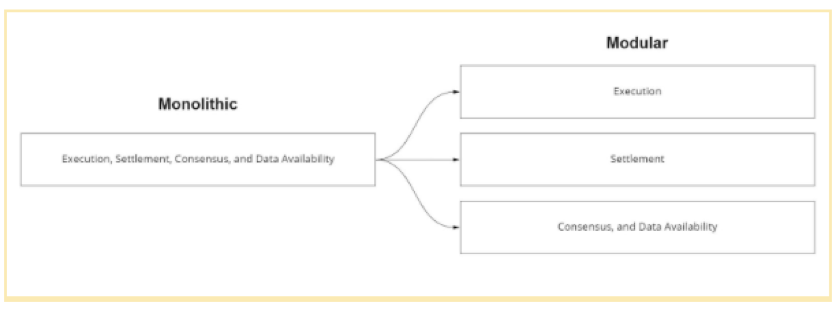

#### Introduction

Blockchain researchers have long grappled with the challenge of creating the optimal system. Many architectures have been tried whose goal was to accommodate all users on a single chain or a tightly coupled group of chains that live under a single network. This approach has proved limited and complex in scaling a system for millions of users.
Solutions to this challenge progressed with the designs of layer 2 blockchains to provide additional scale to layer 1. The concept of splitting blockchains up into separate components introduced the idea that a single blockchain doesn’t need to do everything on its own. 

The next evolution of that concept is modular blockchains. By making the blockchain modular and splitting up its processes among multiple specialized layers, a more optimal system can be created that is sovereign, scalable, and secure.

#### Modular blockchains

The framework behind modular blockchains is rooted in the principle of modular design, which is the concept of dividing a system into smaller parts that can be independently created or exchanged between different systems.

A modular blockchain is a type of blockchain that is part of a modular stack. A modular stack consists of layers of modular blockchains that combine to achieve the same functions as a monolithic chain. 

##### The functions that modular blockchains can specialize in are:

- Execution: Processes transactions.
- Settlement: Optional dispute resolution and bridge.
- Consensus: Orders transactions.
- Data availability: Ensures data is available.

While naive implementations of modular stacks were first introduced with layer 2s, rather than scaling monolithic chains an entirely new stack of purpose-built modular blockchains can be built to take advantage of this new paradigm.

Rollups are a type of blockchain that specialize in execution, off-loading settlement, consensus, and data availability to separate layers. As a modular blockchain, Celestia specializes in consensus and data availability while off-loading execution to separate chains, such as rollups.

Celestia is different from blockchain constructions thus far because they have all had execution as core functionality. Recognizing that modularity allows blockchains to be created for specific purposes, there is no need for execution because that can be the job of a separate chain. Doing so alleviates some of the bottlenecks associated with a monolithic chain.

#### Monolithic blockchains

This introduces limitations when faced with the scalability trilemma. The trilemma states that a blockchain can only have two out of three properties: scalability, decentralization, and security. Retaining all key functions on a single monolithic blockchain creates constraints that can be minimized when they are decoupled across multiple layers.

##### These constraints include:

- **Inefficient transaction verification:** Nodes must re-execute transactions to check validity.
- **Resource constraints:** The blockchain is bound by the resource capacity of its nodes.
- **Scalability:** To increase throughput, security or decentralization must be sacrificed to some degree.

#### Benefits of modular blockchains

Sovereignty 

New modular blockchains can be sovereign like layer 1 despite the utilization of other layers. This allows the blockchain to respond to hacks and push upgrades without permission from any underlying layers. This would be possible for blockchains that utilize Celestia as it won’t impose any restrictions on them. Essentially, sovereign blockchains retain the ability for social consensus to make critical decisions, which is one of the most important facets of blockchains.  

Creating new blockchains

Since blockchains don’t need to handle all adaptive components to function, new blockchains can simply utilize existing modular blockchains for the components they wish to off-load. This allows new blockchains to be bootstrapped efficiently, reducing time to deployment and minimizing costs. For example, a rollup SDK, like Optimint, will help facilitate the creation of new blockchains without needing to bootstrap a new consensus network, a large validator set, or a wide token distribution.

Scalability

Modular blockchains aren’t constrained by having to handle all the adaptive components. By splitting them into multiple layers, scaling can be accomplished without sacrificing security or decentralization. This enables sustainable blockchain scalability that is compatible with a decentralized, multi-chain landscape.

 

#### Conclusion

**Modular blockchains are a new dynamic that change the way blockchains can be constructed and utilize each other for an improved system. This facilitates the scalability and bootstrapping of new blockchains while preserving their sovereignty.**

1. A modular blockchain is one in which at least one of four adaptive components is outsourced to an 		external chain. Multiple modular blockchains can work together as part of a modular stack. A modular 		stack consists of layers of specialized blockchains that utilize each other to create a complete system.
2. Monolithic blockchains are limited by handling all adaptive components on a single layer. When faced with 		the scalability trilemma, an effort to increase throughput will require the sacrifice of reduced security or		decentralization.
3. Modular blockchains provide many benefits over their monolithic counterparts, some of which include 		efficiently creating new blockchains, sovereignty, and scalability.

