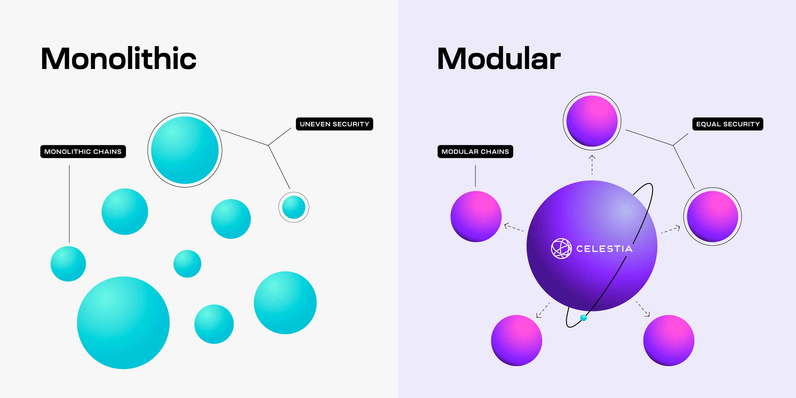

<head>
  <meta name="twitter:card" content="summary_large_image">
  <meta name="twitter:site" content="@CelestiaOrg">
  <meta name="twitter:creator" content="@likebeckett">
  <meta name="twitter:title" content="Benefits of Modular Blockchains">
  <meta name="twitter:description" content="The strengths and advantages of modular blockchains.">
  <meta name="twitter:image" content="https://raw.githubusercontent.com/celestiaorg/celestia.org/main/src/pages/markdown-pages/learn/images/learn-modular-twitter-card.png">
<head/>

#### Scalability
Remember, a core idea of modular blockchains is that they separate functions across multiple chains. This concept also brings extra scalability. A modular L1 like Celestia can now specialize in data availability. Without smart contracts, the L1 can focus all its resources on providing data for L2s, like rollups. Specialization is key because more data the L1 can provide allows rollups to process more transactions.

As for transactions, in the monolithic world, all apps live on the same chain. The downside is that users of different applications all have to compete to get their transactions processed. In the modular paradigm, apps live on separate chains. This means that a user of one app isn’t competing with the users of a different app for computation. So, transactions for many different apps can get processed at the same time.

#### Shared security 
Each time a new monolithic blockchain launches, a crucial part of the process is that they must bootstrap their own validator set. Unfortunately, it can be difficult to source a large enough validator set to become secure. Differences between chains leads to uneven security in an ecosystem of monolithic chains. A few will have high security with large validator sets, while many others will have low security with small validator sets. If we expect thousands of chains or more to make up the multi-chain ecosystem, we can’t expect each one of them to have enough security.

With shared security, deploying new blockchains like rollups doesn’t require bootstrapping a new validator set. Security is provided to blockchains by a common source, like Celestia. A new blockchain can deploy to Celestia and immediately tap into the security that it has built.

Since all chains deployed on Celestia receive even security from its validator set, there is no security fragmentation. Let’s not forget that shared security also helps with building secure bridges. Celestia provides the data availability so blockchains can easily check if their transactions were published. Then, the connected blockchains can use proofs to secure the bridge and make sure transactions are correct.

It is shared security that provides a scalable and efficient way to bootstrap a blockchain ecosystem while enabling secure bridging.

#### Sovereignty
When an app is built on a shared monolithic blockchain, it is bound by predetermined rules. The rules might be around social consensus (when it's okay to hard fork) or around technical rules (what programming languages you can write smart contracts in).

Modular blockchains enable control over the rules of an application through sovereignty. Developers can make changes to the tech stack without permission from outside applications. For example, they could make a more performant execution environment or change how transaction processing works - who wants parallel transactions?

Importantly, sovereignty gives independence. Developers and the community can freely set the rules for their sovereign chain that aligns with their app and community’s ethos. It is sovereignty that places autonomy back in the hands of the community.
