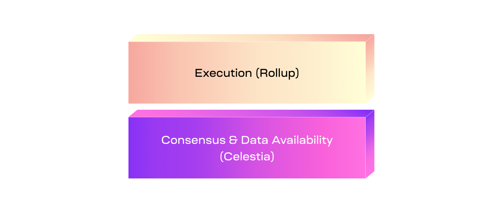

<head>
  <meta name="twitter:card" content="summary_large_image">
  <meta name="twitter:site" content="@CelestiaOrg">
  <meta name="twitter:creator" content="@likebeckett">
  <meta name="twitter:title" content="Basics of Modular Blockchains">
  <meta name="twitter:description" content="Blockchain researchers have long grappled with the challenge of creating the optimal system. Many architectures have been tried whose goal was to accommodate all users on a single chain or a tightly coupled group of chains that live under a single network.">
  <meta name="twitter:image" content="https://raw.githubusercontent.com/alex-beckett/celestia.org/learn-modular-twitter-card/src/pages/markdown-pages/learn/images/Learn_Modular_Twitter_Card%201.png">
<head/>
   

#### Summary
1. A modular blockchain is a type of blockchain that is part of a modular stack. A modular stack consists of layers of specialized blockchains that utilize each other to create a complete system.
2. Monolithic blockchains are limited by handling all functions on a single layer. To increase throughput, security or decentralization must be sacrificed.
3. Modular blockchains provide many benefits over their monolithic counterparts, some of which include efficiently creating new blockchains, sovereignty, and scalability.
  
  
#### Introduction

Blockchain researchers have long grappled with the challenge of creating the optimal system. Many architectures have been tried whose goal was to accommodate all users on a single chain or a tightly coupled group of chains that live under a single network. This approach has proved limited and complex in scaling a system for millions or billions of users. Solutions to this challenge progressed with sharding and layer 2 blockchains to provide additional scale to layer 1. The concept of splitting blockchains up into separate components introduced the idea that a single blockchain doesn’t need to do everything on its own. 

The next evolution of that concept is modular blockchains. By making the blockchain modular and splitting up its processes among multiple specialized layers, a more optimal system can be created that is sovereign, scalable, and secure.

#### Modular blockchains

The framework behind modular blockchains is rooted in the principle of modular design, which is the concept of dividing a system into smaller parts that can be independently created or exchanged between different systems.

A modular blockchain is a type of blockchain that specializes in only a few functions, rather than all of them. Because of this, modular blockchains are arranged in a stack that combine to achieve the same functions as a monolithic chain.

##### The functions that modular blockchains can specialize in are:

- Execution: Processes transactions.
- Settlement: Dispute resolution and bridge (optional).
- Consensus: Orders transactions.
- Data availability: Ensures data is available.

While naive implementations of modular stacks were first introduced with rollups, rather than scaling monolithic chains an entirely new stack of purpose-built modular blockchains can be used to take advantage of this new paradigm.

Rollups are a type of modular blockchain that specialize in execution, off-loading settlement, consensus, and <a href="https://celestia.org/glossary/data-availability" target="_blank" rel="noopener noreferrer" style="color:#7B2BF9;">data availability</a> to separate layers. Celestia is another modular blockchain that specializes in consensus and data availability, off-loading execution to separate chains, such as <a href="https://celestia.org/glossary/rollup" target="_blank" rel="noopener noreferrer" style="color:#7B2BF9;">rollups</a>.

Celestia is different from previous blockchain designs, which had execution as core functionality. Recognizing that modularity allows blockchains to be created for specific purposes, there is no need for execution because that can be the job of a separate chain. Doing so alleviates the largest bottlenecks associated with a monolithic chain from the base layer: transaction execution and state bloat.

#### Monolithic blockchains

Monolithic blockchains are chains that handle all four functions. Where a modular stack splits up components across multiple layers, monolithic blockchains do everything at the same time on a single layer.

##### Some of the constraints that monolithic blockchains face include:

- **Inefficient transaction verification:** Nodes must re-execute transactions to check validity.
- **Resource constraints:** The blockchain is bound by the resource capacity of its nodes.
- **Scalability:** To increase <a href="https://celestia.org/glossary/throughput" target="_blank" rel="noopener noreferrer" style="color:#7B2BF9;">throughput</a>, security or decentralization must be sacrificed to some degree.

#### Benefits of modular blockchains

##### Sovereignty 

New modular blockchains can be sovereign like layer 1s despite the utilization of other layers. This allows the blockchain to respond to hacks and push upgrades without permission from any underlying layers. This would be possible for blockchains that utilize Celestia as it won’t impose any restrictions on them. Essentially, sovereign blockchains retain the ability for <a href="https://celestia.org/glossary/social-consensus" target="_blank" rel="noopener noreferrer" style="color:#7B2BF9;">social consensus</a> to make critical decisions, which is one of the most important facets of blockchains as social coordination mechanisms.

##### Launching new blockchains

Since modular blockchains don’t need to handle all functions, new blockchains can simply utilize existing modular blockchains for the components they wish to off-load. This allows new blockchains to be bootstrapped efficiently, reducing time to deployment and minimizing costs. For example, a rollup "SDK" like <a href="https://github.com/celestiaorg/optimint" target="_blank" rel="noopener noreferrer" style="color:#7B2BF9;">Optimint</a> combined with the Cosmos SDK will help facilitate the creation of new blockchains without needing to bootstrap a secure validator set.

##### Scalability

Modular blockchains aren’t constrained by having to handle all the functions. By splitting them into multiple layers, scaling can be accomplished without sacrificing security or decentralization. This enables sustainable blockchain scalability that is compatible with a decentralized, multi-chain landscape.
