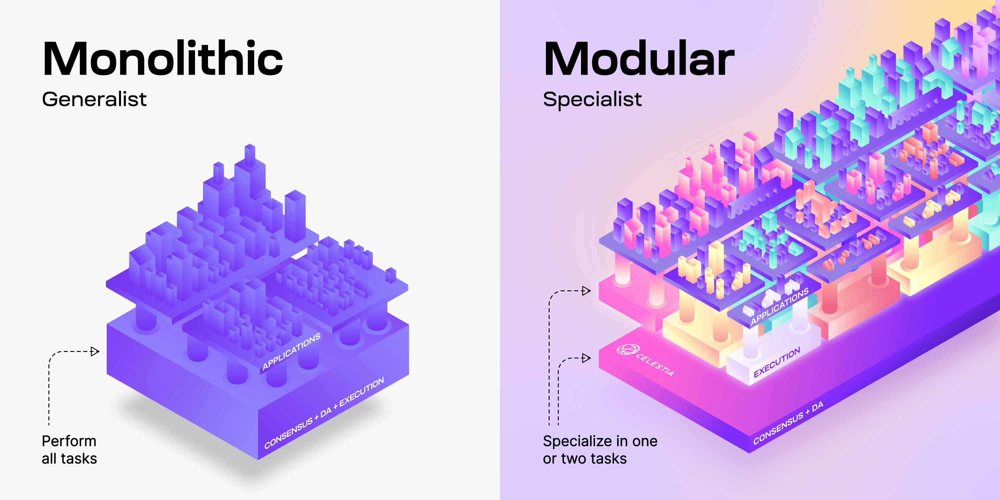
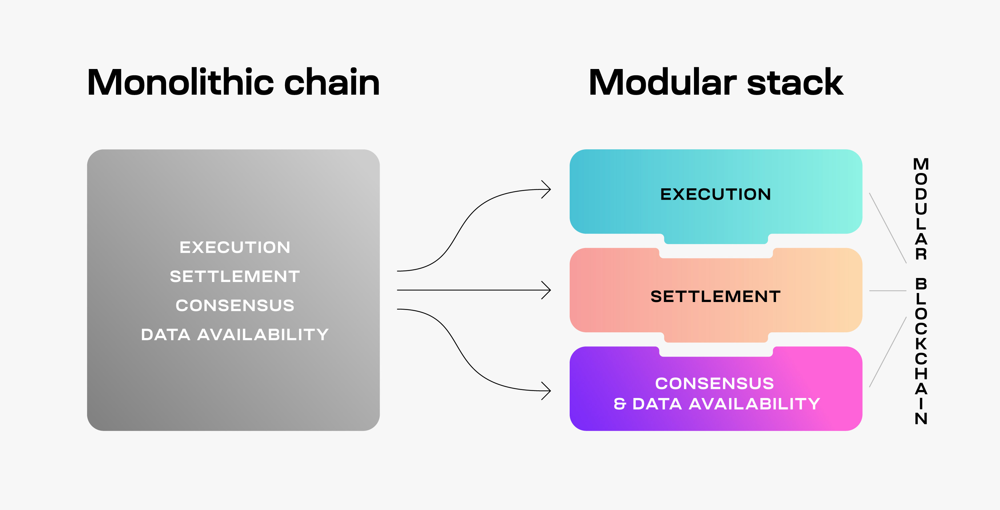

<head>
  <meta name="twitter:card" content="summary_large_image">
  <meta name="twitter:site" content="@CelestiaOrg">
  <meta name="twitter:creator" content="@likebeckett">
  <meta name="twitter:title" content="Modular blockchains for beginners">
  <meta name="twitter:description" content="What are modular blockchains exactly?">
  <meta name="twitter:image" content="https://raw.githubusercontent.com/celestiaorg/celestia.org/main/src/pages/markdown-pages/learn/images/learn-modular-twitter-card.png">
<head/>

Modular blockchains are changing the way we think of and build decentralized applications.

That’s pretty much what everyone says about their new blockchain tech. So, why care about modular blockchains? Why is this time different?

We could write a whole book about all the fantastic things that modular blockchains can do. But most people don’t have time to read a whole book, so we wrote this short article instead to give you the big picture.

#### The limits of monolithic
Most blockchains today are monolithic, so it only makes sense to understand what they are before we explain what modular means.

A monolithic chain is a generalist blockchain that performs all tasks. Really, the monolithic approach is “do everything yourself”.

Some blockchains that fall into this monolithic category include Solana and Sui.

We can’t forget that monolithic chains were a big first step. They showed us that you could build all sorts of new applications using blockchains. Once people started building and using apps on them, they ran into some difficulties. 

- You can’t build anything you like. Sharing space on someone else’s blockchain limits what you can build for your app.
- Expensive apps. High fees can creep up, making apps unaffordable.
- Access isn’t open to all. Raising capacity usually means fewer people can afford to check that the network is running correctly.

Many of these difficulties make monolithic blockchains difficult to use or miss the reasons why we use blockchains in the first place.

#### What is a modular blockchain?
In the last few years, a new approach to building blockchains emerged. That new approach is what people are calling “modular blockchains”. But what are they exactly?

Well, modular blockchains are specialists. They perform only one or two tasks - the opposite of monolithic chains.

Modular chains don’t sit alone, though. Multiple of them combine to perform all the tasks a monolithic chain does by itself. This combination of chains is what we call a modular stack.

There might be some unfamiliar terms in the image above, like data availability or execution. Don’t worry. We’ll go over those in later articles.

You can think about modular blockchains like Lego pieces. You can mix and match Legos to create different structures, just like you can mix and match modular blockchains to create different modular stacks.

In the modular category we have blockchains like Celestia and <a href="https://celestia.org/glossary/rollup" target="_blank" rel="noopener noreferrer" style="color:#7B2BF9;">rollups</a>. Rollups host applications and do many of the same things that monolithic blockchains do. What makes a rollup modular is that it uses another blockchain, like Celestia, to complete the tasks it doesn’t do.

------ image here

As you can tell, modular chains specialize and work together to do all the tasks a single monolithic chain does. If there’s one thing you should take away about modular and monolithic chains, it’s that:
- Monolithic = generalist
- Modular = specialist

#### Why is modular an improvement?
You know what modular blockchains are now. But, how do they improve upon the difficulties that monolithic blockchains face?

##### Modular chains let you build whatever you want

Celestia is really simple for a reason. Without execution, Celestia has way fewer restrictions on how applications and modular blockchains can be built on it. The wide design space includes everything from new virtual machines to unique privacy models and new types of blockchain architectures. That only scratches the surface.

Really, devs can <a href="https://celestia.org/developer-portal/" target="_blank" rel="noopener noreferrer" style="color:#7B2BF9;">build whatever they want</a>.

##### Modular chains let you make apps cheap to use

And of course, we want to do all of this while keeping it cheap for users to play around with applications.

<a href="https://celestia.org/glossary/data-availability-sampling/" target="_blank" rel="noopener noreferrer" style="color:#7B2BF9;">Data availability sampling</a> is the technology that Celestia uses to make this happen. The name might sound confusing. But, all it means is that Celestia can provide more capacity for applications as more users join the network.

##### Modular chains let you create open access for all
But, if people can’t afford to check the chain, then it’s not that much different than using a centralized application. That’s why it's essential to keep it inexpensive for people to confirm the blockchain is running correctly.

Technologies like data availability sampling and <a href="https://celestia.org/glossary/state-transition-fraud-proof/" target="_blank" rel="noopener noreferrer" style="color:#7B2BF9;">fraud</a> or <a href="https://celestia.org/glossary/validity-proof/" target="_blank" rel="noopener noreferrer" style="color:#7B2BF9;">validity proofs</a> are used by modular blockchains to make this possible. As you journey down the modular rabbit hole, you’ll see these terms come up quite a bit. All you need to know for now is that they can help make blockchains really inexpensive for people to check they’re running correctly.

#### Conclusion
And that’s the simplified version of modular and monolithic blockchains. Monolithic blockchains came first to show us what was possible with decentralized applications. And now we have modular blockchains to take the ideas further, while sticking to the values we love about blockchains.