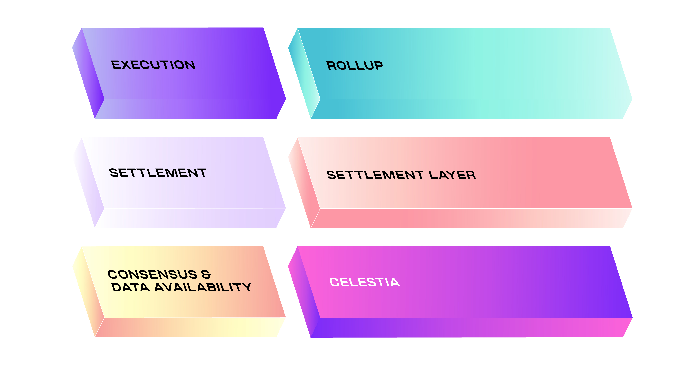

<head>
  <meta name="twitter:card" content="summary_large_image">
  <meta name="twitter:site" content="@CelestiaOrg">
  <meta name="twitter:creator" content="@likebeckett">
  <meta name="twitter:title" content="Settlement in the Modular Stack">
  <meta name="twitter:description" content="A look at how settlement layers work in the modular paradigm.">
  <meta name="twitter:image" content="https://raw.githubusercontent.com/celestiaorg/celestia.org/main/src/pages/markdown-pages/learn/images/learn-modular-twitter-card.png">
<head/>

#### Summary 
* Settlement layers provide multiple purposes for rollups, which include proof verification & dispute resolution, a hub to facilitate cross-rollup bridging, and a source of liquidity.
* An ideal settlement layer can provide maximal capacity to rollups by incentivizing applications to only deploy to rollups and not directly on the settlement layer.
* By introducing fraud or validity proofs, a settlement layer can enhance the security of light clients, allowing them to verify valid or invalid blocks.

#### Introduction
The modular blockchain paradigm creates many potential configurations in which blockchains can connect. Since modular blockchains only handle a subset of functions, more specialization can be facilitated. Settlement is one function, in particular, that can become optimized and specialized by a modular blockchain. 

#### Settlement layers
Many blockchains can be used as settlement layers, though most of them are monolithic chains that become settlement layers through a need to process more transactions (scaling). A settlement layer in the modular stack can specialize in settlement while outsourcing the remaining components, like consensus and data availability, to other modular blockchains.

Uniquely, settlement layers are an optional feature in the modular paradigm as sovereign rollups can use a standalone consensus and data availability layer. This allows rollup developers to pick and choose the modular stack that best suits their needs.

##### Settlement layers provide multiple purposes for rollups:
* Proof verification & dispute resolution: A place for rollups to publish their proofs for external verification. This is especially useful for optimistic rollups that rely on interactive fraud proofs.
* Hub to facilitate bridging: Rollups can bridge between each other if they go through a common settlement layer. A hub removes the need for all rollups to have a bridge between each other.
* Liquidity source: Liquidity that lives on the settlement layer can be utilized by all rollups on top.

#### Settlement in the modular stack
When deploying a rollup on a modular settlement layer, the modular stack can take the form of three distinct layers.

In the three-layer modular stack, the rollup at the top is where user-facing applications live. Like a typical rollup, it publishes batches of transactions to the settlement layer and pays a fee in its designated token. The settlement layer will also verify any fraud or validity proofs that are published by the rollup.

From there, the rollup doesn’t need to have any direct contact with Celestia. The settlement layer will independently build its own batches, including transactions submitted by the rollup, and publish them to Celestia. Notably, the settlement layer can itself take the form of a rollup on Celestia.  

Alternatively, the rollup could publish its transaction data directly to Celestia and its proofs to the settlement layer separately. Regardless, the process is abstracted away from users and apps as they are only exposed to the requirements on the rollup, such as the gas token and wallet type.

#### Specialized settlement layers
The primary purpose of settlement layers is to cater to the rollups that deploy on top. To create an optimal settlement layer for them, multiple optimizations are possible. Settlement layers can provide maximal block space to rollups by restricting or heavily disincentivizing applications from launching on the settlement layer. If users are interacting with settlement layer applications, they are simultaneously competing with the rollups for block space. Instead, user-facing applications should live on dedicated execution layers. A settlement layer without user-facing applications can provide maximal capacity for its rollups.

By introducing fraud or validity proofs, the settlement layer can create trust-minimized light clients. Security increases because settlement layer light clients can receive and verify a proof that a block is valid or invalid. Now light clients can reject invalid blocks, unlike naive light clients that get fooled by a dishonest majority of validators. As a result, any execution layers that want to verify the settlement layer don’t have to run a full node but can instead run a secure light node.
