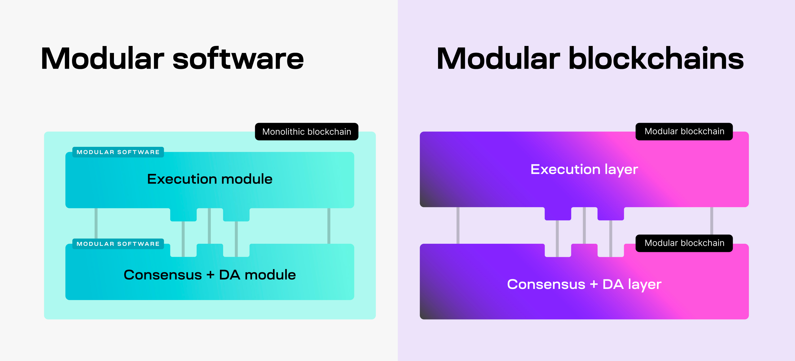
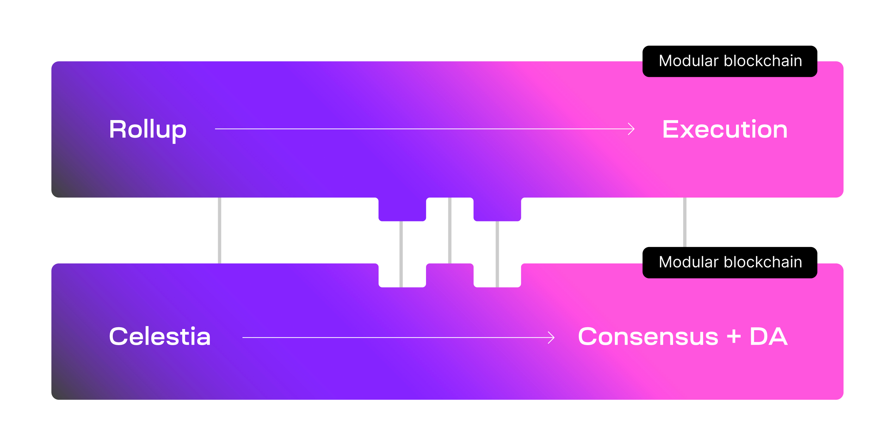

<head>
  <meta name="twitter:card" content="summary_large_image">
  <meta name="twitter:site" content="@CelestiaOrg">
  <meta name="twitter:creator" content="@likebeckett">
  <meta name="twitter:title" content="The differences of modular software">
  <meta name="twitter:description" content="What is modular software and how is it different to modular blockchains?">
  <meta name="twitter:image" content="https://raw.githubusercontent.com/celestiaorg/celestia.org/main/src/pages/markdown-pages/learn/images/learn-modular-twitter-card.png">
<head/>

#### Summary
1. Modular software and modular blockchains are often confused for one another, but they mean very different things
2. Modular software separates the core functions of a blockchain among different pieces of software, enabling a more flexible and efficient blockchain development process.
3. Modular blockchains are live blockchain networks that specialize in one or two core functions.
4. <a href="https://github.com/celestiaorg/rollmint" target="_blank" rel="noopener noreferrer" style="color:#7B2BF9;">Rollmint</a> is a development kit that combines the principles of modular software and modular blockchains, enabling developers to easily deploy new blockchains with minimal overhead.

#### Intro
Modularity is an essential concept in the design and development of blockchains. It enables developers to focus on customizing the parts of the blockchain they care about most. Many blockchains exist that use modular software to improve their development process. However, a blockchain built using modular software should not be confused with a modular blockchain. Let’s look at some of the differences between modular blockchains and modular software.

#### Modular blockchains and modular software
Modular software and modular blockchains share the same idea: a blockchain's core functions can be distinct components. But the two go about it in different ways.

- **Modular blockchain:** A blockchain that specializes in one or two core functions. Modular blockchains with different specialties combine together to fulfill all the core functions needed.
- **Modular software:** Software for building blockchains that separates the core functions among different pieces of software.

The key difference between the two is that modular software is the code that is used to build the blockchain, while a modular blockchain is a live blockchain network.

An example of a modular blockchain is a rollup because it specializes in a single function - execution. A rollup processes transactions and sends them to another modular blockchain to handle the other core functions - consensus and data availability.

On the other hand, an example of modular software is Tendermint and the Cosmos SDK. Tendermint is the consensus software that validators run to produce new blocks. The Cosmos SDK is the execution environment that processes transactions. Together, Tendermint and the Cosmos SDK serve as a toolkit for building blockchains.

Since the software is modular, it is easier to change or swap out specific parts of the blockchain. For example, a developer can build a blockchain that uses Tendermint for consensus and use a different execution environment, like the EVM.

#### Use cases of modular software
##### Monolithic blockchains
The most common use case so far for modular software is for building monolithic blockchains. Instead of building a new blockchain from scratch when a team wants to make improvements, modular software enables them to use an existing framework to build off of. This allows developers to focus on improving specific parts of the blockchain they want to, without worrying about building all the blockchain’s features.

Tendermint and the Cosmos SDK have since become the most used modular software for building monolithic blockchains, with over <a href="https://mapofzones.com/home?columnKey=dau&period=30d" target="_blank" rel="noopener noreferrer" style="color:#7B2BF9;">45 public chains</a> running today. Some of those include monolithic blockchains like the Cosmos Hub and even modular blockchains like rollups.

##### Rollups
We know that modular software is useful for building monolithic blockchains, but it can also be useful for building modular blockchains like rollups. For example, you can take the Cosmos SDK and replace Tendermint with some rollup software, so now you get a Cosmos SDK rollup. This rollup software is exactly how Rollmint works.

Rollmint enables developers to build rollups using the principles of modular software and modular blockchains. Components of Rollmint’s software can be easily modified or replaced, like the execution environment, so developers can run any number of compatible VMs, such as the Cosmos SDK or the EVM. This culminates in a flexible framework for developers that enables them to easily deploy new modular blockchains with minimal overhead.
